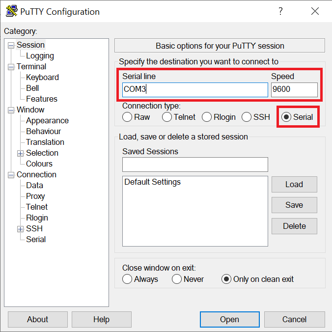
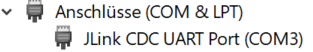

FAQ
==========

Wie verbinde ich meinen PC mit dem IoT-Pilot?
----------
Die Entwichlingsumgebung stellt im normalfall automatisch eine Verbindung zum Developer-Kit her.

Wie greife ich auf die Terminalausgaben des IoT-Pilots zu?
----------
Um die Terminalausgaben des IoT-Pilots zu sehen wird ein serielles Terminal (z.B. [Putty](https://www.putty.org)) benötigt.

"Serial" muss gewählt sein um anschließend den "COM-Port" sowie die Speed von 9600 einzutragen

Der "COM-Port" kann über den Geräte-Manager bestimmt werden. (Geräte-Manager -> Anschlüsse(COM&LPT) -> JLink CDC UART Port (COM#) )

